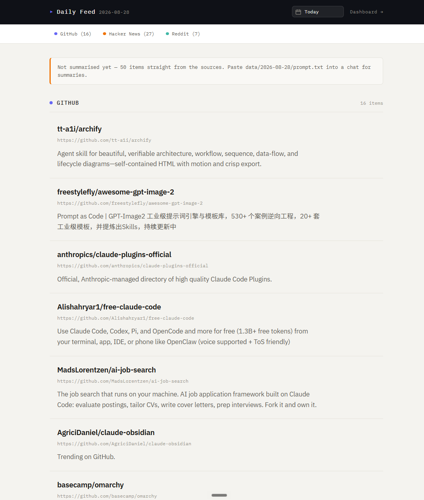
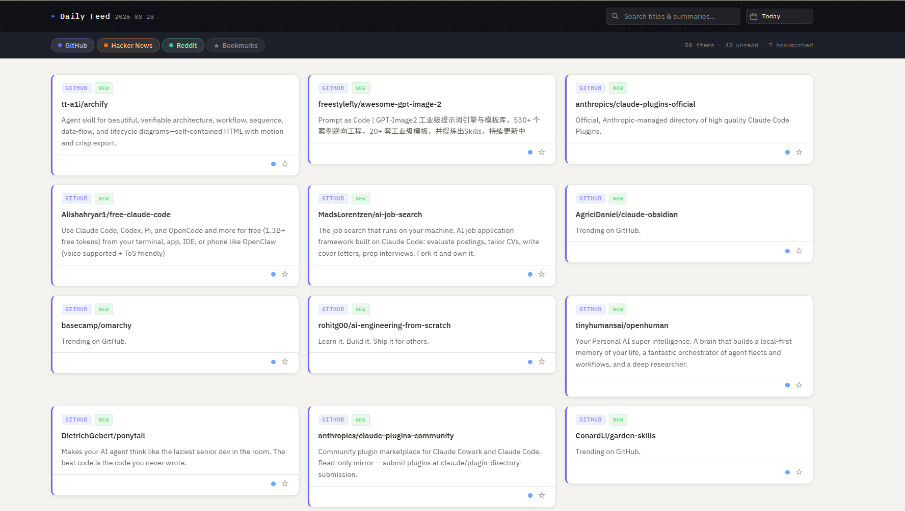

# Daily Feed

[](LICENSE)
[](https://nodejs.org)
[](https://www.gnu.org/software/bash/)

> A local technical news aggregator. Pulls GitHub Trending, Hacker News, and Reddit every
> morning, summarises the day in one pass, and serves it as a clean reading view at
> `localhost:3000`.

Daily Feed replaces the morning ritual of opening six tabs and skimming the same stories twice.
It fetches the last 24 hours from three sources, deduplicates and normalises them into flat JSON,
and renders the result as either a top-to-bottom reading view or a filterable card dashboard.
Archived days stay browsable forever.

The design is deliberately small: **no database, no authentication, no email delivery, no
framework.** Data is flat JSON files on disk, the server is ~100 lines of Express, and the
front end is vanilla JavaScript. The whole thing runs offline once the data is fetched.

It is also **zero-cost to run.** The summarisation step is split at the LLM boundary — the shell
scripts gather the day's items into a single paste-ready prompt and stop there. No API key is
ever needed, no per-item API calls are made, and nothing bills to your account. You paste one
prompt into a chat, save the reply, and a jq script turns it into the feed.

---

## Screenshots

> **Placeholder** — drop your images into `docs/screenshots/` and the links below will resolve.

### Reading view — `localhost:3000`

<!--  -->

_The default page: the day's `feed.md` rendered top to bottom, with a jump nav and date picker._

### Card dashboard — `localhost:3000/dashboard`

<!--  -->

_Source filters, search, bookmarks, and read/unread tracking._

### Archive browsing — `localhost:3000/YYYY-MM-DD`

<!--  -->

_Any previously fetched day, served from `data/YYYY-MM-DD/`._

| File to add | Shows |
|---|---|
| `docs/screenshots/reading-view.png` | Default reading view with a summarised day |
| `docs/screenshots/dashboard.png` | Card grid with filters active |
| `docs/screenshots/archive.png` | Date picker open on the archive list |

Once the files exist, uncomment the `<!-- ![...] -->` lines above.

---

## Features

**Aggregation**
- Three sources fetched in parallel-safe sequence: GitHub Trending, Hacker News, Reddit
- Per-source failure isolation — one dead API doesn't abort the run, and failures are logged to `data/fetch-errors.log`
- Configurable time window; every fetch script takes `$1=output_dir $2=since_ts $3=until_ts`

**Reading**
- Reading view with rendered markdown, section jump-nav, and a raw-markdown link
- Card dashboard with source filters (GitHub / HN / Reddit) and a bookmarks-only toggle
- Client-side search across titles and summaries
- Read/unread tracking and per-item bookmarks, persisted in `localStorage`
- Live counts for total / unread / bookmarked, plus bulk "mark all read" and "clear read"
- Date picker to browse every archived day

**Operations**
- One-command bootstrap — `start.sh` installs dependencies, starts the server, then fetches
- Dashboard comes up **first** and serves existing data, so a slow or failed fetch never takes the page down
- Provisional feed built straight from raw JSON, so today's items appear immediately with no LLM involved
- Overwrite guard: a provisional feed carries a `note` field marking it safe to rebuild — once you paste real summaries the note disappears and the pipeline leaves your work alone
- Every day archived to `data/YYYY-MM-DD/` automatically

---

## How it works

```
 scripts/          summarise/                        web/
┌──────────┐     ┌───────────────┐                 ┌──────────┐
│ fetch-*  │────▶│ prepare-items │──▶ prompt.txt   │ server.js│
│  ×3      │     └───────────────┘         │       │  :3000   │
└──────────┘                               ▼       └──────────┘
     │                              ╔═════════════╗      ▲
     ▼                              ║  you paste  ║      │
 data/*.json                        ║  into chat  ║      │
                                    ╚═════════════╝      │
                                           │             │
                                           ▼             │
                                     items.json          │
                                           │             │
                                    ┌──────────────┐     │
                                    │  build-feed  │─────┘
                                    └──────────────┘
                                    feed.json + feed.md
```

The double-walled box is the only manual step, and it is manual on purpose: the shell never
calls an LLM, so the pipeline has no API key, no network cost, and no failure mode where a
model call breaks your morning. All items go in **one** paste, never one per item.

If you skip the paste entirely, `build-raw-feed.sh` still produces a usable feed from the raw
JSON — titles, links, and each source's own metadata, just without summaries.

### Sources

| Source | Endpoint | Auth |
|---|---|---|
| GitHub Trending | [GitHubTrendingRSS](https://mshibanami.github.io/GitHubTrendingRSS/) daily feed | none |
| Hacker News | Algolia search API, top stories past 24h | none |
| Reddit | `r/programming+MachineLearning` public Atom feed | none |

> **Reddit note:** the JSON API (`/top.json`) now returns `403` for unauthenticated clients
> regardless of User-Agent, so the Atom feed is parsed instead. All subreddits are fetched in a
> single combined `r/a+b` request because the feed rate-limits hard on back-to-back calls —
> which means adding a subreddit costs no extra request.

---

## Requirements

- **bash**, **curl**, **jq** — all JSON parsing is done with `jq`; no Python or Node in the shell scripts
- **Node.js 18+** — for the web server (Express 5)
- **No API key** — summarisation is a manual paste, so there is nothing to configure and nothing to bill

Verified on Node v22.14 and jq 1.8.1. Runs on Linux, macOS, WSL, and Git Bash on Windows.

---

## Installation

**1. Clone the repository**

```bash
git clone https://github.com/Thant9330/Daily-Feed.git
cd Daily-Feed
```

**2. Install `jq`** (skip if you already have it — `start.sh` will also attempt this for you)

```bash
sudo apt-get install -y jq     # Debian / Ubuntu / WSL
brew install jq                # macOS
winget install jqlang.jq       # Windows
```

**3. Install Node dependencies**

```bash
cd web && npm install && cd ..
```

**4. Run it**

```bash
bash start.sh
```

That single command installs anything missing, starts the dashboard, fetches today's news, and
builds a provisional feed. Open **http://localhost:3000**.

---

## Usage

### Everyday

```bash
bash start.sh     # deps, server, fetch, provisional feed — one command
```

### Individual steps

```bash
npm start                          # server only, port 3000
npm run fetch                      # fetch raw data → data/*.json
npm run prepare                    # build data/YYYY-MM-DD/prompt.txt (no LLM called)
npm run refresh                    # fetch + prepare
```

### Getting real summaries

```bash
bash summarise/prepare-items.sh              # → data/YYYY-MM-DD/prompt.txt
# paste prompt.txt into a chat, save the JSON array it returns as:
#   data/YYYY-MM-DD/items.json
bash summarise/build-feed.sh data/YYYY-MM-DD/items.json
```

`build-feed.sh` expects a plain JSON array — strip any code fences before saving.

### Claude Code slash commands

| Command | Does |
|---|---|
| `/fetch` | Fetch raw data only |
| `/summarise` | Prepare the prompt from existing raw data |
| `/refresh` | Fetch, then prepare the prompt |

### Routes

| Route | Serves |
|---|---|
| `/` | Reading view — today's `feed.md` rendered |
| `/YYYY-MM-DD` | Reading view for an archived day |
| `/dashboard` | Card UI with filters, search, bookmarks |
| `/api/feed` · `/api/feed/:date` | Feed JSON |
| `/api/feed.md` · `/api/feed.md/:date` | Raw markdown |
| `/api/dates` | List of available archive dates |

---

## Project structure

```
daily-feed/
├── scripts/            fetch-{github,hackernews,reddit}.sh + run-all.sh
├── summarise/          prepare-items.sh, build-feed.sh, build-raw-feed.sh (pure jq)
├── data/               raw JSON, feed.json, feed.md, and YYYY-MM-DD/ archives
├── web/
│   ├── server.js       Express server
│   └── public/         read.html (default), index.html (dashboard), JS + CSS
└── .claude/            agents, slash commands, hooks
```

### `feed.json` schema

```json
{
  "date": "2026-08-28",
  "items": [
    {
      "id": "github-owner-repo",
      "source": "github",
      "title": "owner/repo",
      "url": "https://github.com/owner/repo",
      "summary": "One-line description of what it does.",
      "tags": [],
      "relevance": 3,
      "read": false,
      "bookmarked": false
    }
  ]
}
```

An optional top-level `note` marks the feed as **provisional** — built from raw data without
summaries, and therefore safe to overwrite. Real summaries leave it unset.

---

## Adding a source

Four edits, nothing else:

1. Write `scripts/fetch-<source>.sh` — interface is `$1=output_dir $2=since_ts $3=until_ts`, output is JSON to `data/<source>.json`
2. Add one line to the `SCRIPTS` array in `scripts/run-all.sh`
3. Add a `<source>_LINES` jq block in `summarise/prepare-items.sh` (plus the source name on its prompt schema line) and a block to the pipeline in `summarise/build-raw-feed.sh`
4. Add a filter toggle in `web/public/index.html` and a `.src-<source>` colour in `web/public/read.css`

See [`HOW_IT_WORKS.md`](HOW_IT_WORKS.md) for a full technical walkthrough and
[`CLAUDE.md`](CLAUDE.md) for the project's design rules.

---

## Documentation

| Doc | Covers |
|---|---|
| [`USER_GUIDE.md`](USER_GUIDE.md) | Day-to-day usage |
| [`HOW_IT_WORKS.md`](HOW_IT_WORKS.md) | Technical walkthrough of every stage |
| [`CLAUDE.md`](CLAUDE.md) | Design constraints and conventions |

---

## License

[MIT](LICENSE) © 2026 Myo Thant Zin
